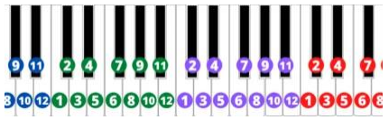
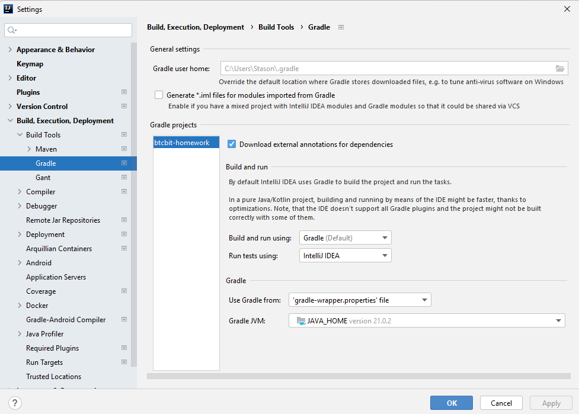

# btcbit-homework

[](https://github.com/ximtech/btcbit-homework/actions/workflows/build.yml)
[](https://file.io/cJEs37WsXZfz)
[](https://codecov.io/gh/ximtech/btcbit-homework)

### Prerequisites

- `JDK 21`

### Task requirements:

- Your project should be built with `Gradle`, with the opportunity to create an executable `.jar`.
- Your program should take three parameters which are passed in the command line:
    - `inputFile` - path to the input file, relative to the executable file directory. This will be an incoming JSON file with a collection of notes
    - `semitone` - a number of semitones to transpose to (can be negative)
    - `outputFile` - path to the output file, relative to the executable file directory. This
   will be an outgoing JSON file with a collection of result notes.
   Example: java -jar task.jar in/a.json 5 out/b.json
- As a result of execution, your `.jar` file should create a file containing the output data
  with the transposed collection of notes.
- If at least one of the input or resulting notes falls out of the keyboard range, your
  script should return an error message and not create any file with the results.
- After solving the task, send the archive file with the project. ***The archive must be named
  with your first and last name***
  
### Description of the task:



- The piano keyboard is divided into octaves, each octave has 12 notes.
- The distance between two random notes is called an `interval`. The interval between two
  neighboring notes is called `semitone`. The interval of 12 semitones (1 octave) doubles the
  sound frequency. Transposition refers to the process or operation of moving a musical piece
  (a collection of notes) up or down in pitch by a constant interval. For example, if you
  transpose 2 tones (4 semitones) down the note 5, it becomes note 1, if you transpose the
  note 2 by the same interval, it will become note 10 of the previous octave etc.
  Let’s define a note as an array of two elements: `[$octaveNumber, $noteNumber]` (e.g. `[1, 7]`).
  We skip the duration of a particular note for simplicity.
  Let’s define a musical piece as a collection of notes (e.g. `[[2, 1], [1, 10], [1, 5]]`).
  The piano keyboard has 7 full octaves `(-2, -1, 0, 1, 2, 3, 4)` and 2 partial ones `(-3 and 5)`. The
  first note is `[- 3, 10]`, the last one is `[5, 1]`.

### Sample input:
```json
  [[2,1],[2,6],[2,1],[2,8],[2,1],[2,9],[2,1],[2,6],[2,1],[2,8],[2,1],[2,9],[2,1],[2,11],[2,1],[2,8],[2,1],[2,9],
  [2,1],[2,11],[2,1],[3,1],[2,1],[2,9],[2,1],[2,11],[2,1],[3,1],[2,1],[3,2],[2,1],[2,11],[2,1],[3,1],[2,1],[2,9
  ],[2,1],[2,11],[2,1],[2,8],[2,1],[2,9],[2,1],[2,6],[2,1],[2,8],[2,1],[2,5],[2,1],[2,6],[2,1],[2,1],[2,1],[2,2]
  ,[2,1],[1,11],[2,1],[2,1],[2,1],[1,9],[2,1],[1,11],[2,1],[1,8],[2,1],[1,9],[2,1],[1,6],[2,1],[1,11],[2,1],[1,
  8],[2,1],[1,9],[2,1],[1,6],[2,1],[1, 8],[2,1],[1,5],[2,1],[1,6]]
```

### Sample output for transposing to -3 semitones:
```json
  [[1,10],[2,3],[1,10],[2,5],[1,10],[2,6],[1,10],[2,3],[1,10],[2,5],[1,10],[2,6],[1,10],[2,8],[1,10],[2,5],[
  1,10],[2,6],[1,10],[2,8],[1,10],[2,10],[1,10],[2,6],[1,10],[2,8],[1,10],[2,10],[1,10],[2,11],[1,10],[2,8
  ],[1,10],[2,10],[1,10],[2,6],[1,10],[2,8],[1,10],[2,5],[1,10],[2,6],[1,10],[2,3],[1,10],[2,5],[1,10],[2,2]
  ,[1,10],[2,3],[1,10],[1,10],[1,10],[1,11],[1,10],[1,8],[1,10],[1,10],[1,10],[1,6],[1,10],[1,8],[1,10],[1,
  5],[1,10],[1,6],[1,10],[1,3],[1,10],[1,8],[1,10],[1,5],[1,10],[1,6],[1,10],[1,3],[1,10],[1,5],[1,10],[1,2]
  ,[1,10],[1,3]]
```

### Run example

- Download jar by provided link
- Navigate to downloaded `jar` location
- Create `in.json` file, then copy content from `Sample input` section
- Open terminal and run command
```text
    java -jar task-1.0.0.jar in.json -3 out.json
```

### Notes

Project should build and pull all dependencies automatically. If error happens, make sure that `IDE` build tool configured correctly:<br/>


